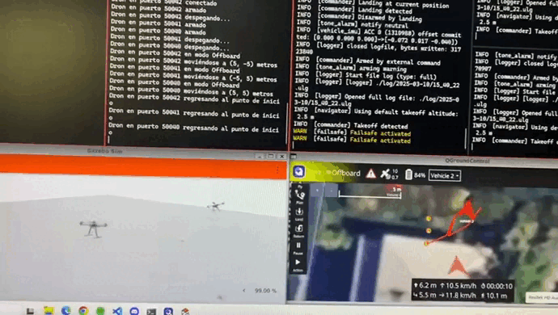

# Dron
# Simulación de Múltiples Drones y Rovers en PX4

Este repositorio contiene scripts para la simulación de múltiples drones y rovers en PX4, usando Gazebo y MAVSDK.

## Códigos que funcionan:

```
Dron/
│── Rover/
│   ├── 3rovers.py
│   ├── variosRovers.py
│── MultiplesDrones/
│   ├── 3drones.py
│   ├── variosDrones.py
│── Crear/
│   ├── crearRovers.sh
│   ├── crearDrones.sh
│   ├── crearServidores.sh
```
### 🏎️ 3rovers.py
Este script controla varios rovers en una simulación con PX4 y MAVSDK.

Arranca las instancias de los rovers en PX4 y configura los servidores MAVSDK para cada uno.
Cada rover se conecta, se arma y "despega".
Se mueven independientemente a una posición específica y luego regresan al punto de inicio.
Finalmente "aterrizan".

### 🚁 3drones.py
Este script hace lo mismo que 3rovers.py, pero con drones en lugar de rovers.

Arranca las instancias de drones en PX4.
Cada dron se conecta, se arma y despega.
Se mueve a una posición específica y luego vuelve a su punto de inicio.

### 🚁🏎️ variosDrones.py y variosRovers.py
Estos scripts permiten simular múltiples drones o rovers en PX4 de manera dinámica. Se ejecutan como:
    ```
    ./variosDrones.py <número_de_drones>
    ./variosRovers.py <número_de_rovers>
    ```
Donde <número_de_drones> o <número_de_rovers> es el número de drones o rovers que deseas simular. Su funcionamiento es similar a los scripts 3drones.py y 3rovers.py, pero con el número de drones o rovers indicado en el parámetro de ejecución.


### 🛠️crearServidores.sh
Este comando genera la cantidad de servidores de MAVSDK necesarios para la simulación de los rovers o drones.
    ```
    ./crearServidores.sh <num_servidores>
    ```


### 🛠️ crearRovers.sh y crearDrones.sh
Estos scripts permiten la creación de instancias de rovers o drones en PX4, pero aún falta ajustar las rutas de los directorios en los scripts para que funcionen correctamente.


## Ejemplos de simulación con 3rovers.py/3drones.py
### Requisitos Previos

- [PX4 Autopilot](https://px4.io/)
- [Gazebo](https://gazebosim.org/)
- [QGroundControl](https://qgroundcontrol.com/)
- [MAVSDK-Python](https://mavsdk.mavlink.io/main/en/python/)

### Simulación de Rovers

1. Arrancar QGroundControl.
2. Iniciar 3 instancias de rovers en PX4:

    ```sh
    PX4_SYS_AUTOSTART=4009 PX4_GZ_MODEL_POSE="1,1" PX4_SIM_MODEL=gz_r1_rover ./build/px4_sitl_default/bin/px4 -i 1
    PX4_SYS_AUTOSTART=4009 PX4_GZ_MODEL_POSE="2,1" PX4_SIM_MODEL=gz_r1_rover ./build/px4_sitl_default/bin/px4 -i 2
    PX4_SYS_AUTOSTART=4009 PX4_GZ_MODEL_POSE="1,1" PX4_SIM_MODEL=gz_r1_rover ./build/px4_sitl_default/bin/px4 -i 3
    ```
3. Comprobar los puertos MAVLink (deberían ser 14541, 14542, 14543):

    ```sh
    mavlink status
    ```
4. Iniciar los servidores MAVSDK:

    ```sh
    /home/alvaro/.local/lib/python3.10/site-packages/mavsdk/bin/mavsdk_server -p 50040 udp://:14541
    /home/alvaro/.local/lib/python3.10/site-packages/mavsdk/bin/mavsdk_server -p 50041 udp://:14542
    /home/alvaro/.local/lib/python3.10/site-packages/mavsdk/bin/mavsdk_server -p 50042 udp://:14543
    ```
5. Ejecutar el script:

    ```sh
    python3 Dron/Rover/3rovers.py
    ```

### Simulación de Drones

1. Arrancar QGroundControl.
2. Iniciar 3 instancias de drones en PX4:

    ```sh
    PX4_SYS_AUTOSTART=4001 PX4_GZ_MODEL_POSE="1,1" PX4_SIM_MODEL=gz_x500 ./build/px4_sitl_default/bin/px4 -i 1
    PX4_SYS_AUTOSTART=4001 PX4_GZ_MODEL_POSE="2,1" PX4_SIM_MODEL=gz_x500 ./build/px4_sitl_default/bin/px4 -i 2
    PX4_SYS_AUTOSTART=4001 PX4_GZ_MODEL_POSE="1,1" PX4_SIM_MODEL=gz_x500 ./build/px4_sitl_default/bin/px4 -i 3
    ```
3. Comprobar los puertos MAVLink (deberían ser 14541, 14542, 14543).
4. Iniciar los servidores MAVSDK:

    ```sh
    /home/alvaro/.local/lib/python3.10/site-packages/mavsdk/bin/mavsdk_server -p 50040 udp://:14541
    /home/alvaro/.local/lib/python3.10/site-packages/mavsdk/bin/mavsdk_server -p 50041 udp://:14542
    /home/alvaro/.local/lib/python3.10/site-packages/mavsdk/bin/mavsdk_server -p 50042 udp://:14543
    ```
5. Ejecutar el script:

    ```sh
    python3 Dron/MultiplesDrones/3drones.py
    ```

(Ambas simulaciones, dependiendo de la posición de inicio, pueden colisionar) 😁




## Autor
Álvaro Ros - Simulación con PX4, Gazebo y MAVSDK

## Licencia
Este proyecto está bajo la **Licencia MIT**. Consulta el archivo `LICENSE` para más detalles.
